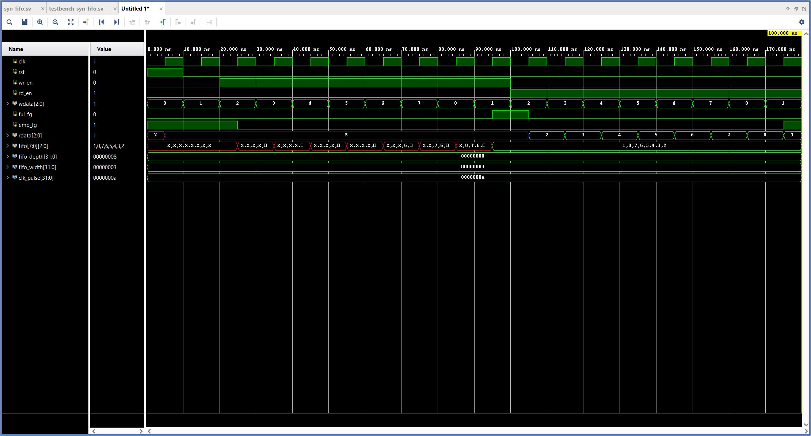

### Synchronous FIFO Design


Main objective of a FIFO is to provide a communication link between two data buses that are running at different clocking rates as well as buses running at the same rate, but the clock generated for each bus originates from different crystals oscillators. When data is transported from one digital system to another system, each operating at different rates, incoming data must be synchronized to the local clock rates before utilising the received data. Synchronization can be achieved when the transmitting system passes the data through a FIFO and the received system receives the data from the same FIFO. Synchronization is possible as FIFOs are built using a dual port memory logic which allows unconstrained simultaneous access through read and write port without any timing restrictions. Popular use of a FIFO is during inter-processor communication where the processors run at different rates. Passing data through a FIFO allows each processor to burst data in and out of FIFO at maximum speeds.

***

### FIFO Architecture

The basic building blocks of a FIFO are : memory array and flag logic. Memory array is built from a dual ported memory cell which allows simultaneous access between read and write port. This simultaneous access gives FIFO its inherent synchronization property. Data is written and read from the memory array using write and read pointers. Whenever a read or a write operation occurs its respective pointers are incremented to the point to next memory location that needs to be read or written. There are two flag logics: one for full and the other for empty. These flag logic compares the read and write pointers to assert full flag or empty flag.


***

### FIFO Module

First, create the module  with name ***syn_fifo*** with all the necessary input and output ports, port direction can be declared in the module or separately in the code. Here, the port directions are  declared in the module. The module consists of five inputs: clk, rst, er_en, rd_en, wdata and three outputs: ful_fg, emp_fg, rdata. For the purpose of understanding ***fifo_depth*** is only value that is available for the user to change. **FIFO width must always be a power of 2.** ***fifo_width*** is determined based on ***fifo_depth***, consequently read and write data width will be ***fifo_width***.

***wr_en*** and ***rd_en*** are write and read enable signals when asserted data will be written or read from the memory array.

***ful_fg*** and ***emp_fg*** are full and empty flags respectively. These flags will output a high value when the FIFO is full or empty.

```Verilog
module syn_fifo #(parameter fifo_depth = 8, parameter fifo_width = $clog2(fifo_depth))(
    input  logic clk,
    input  logic rst,
    input  logic wr_en,
    input  logic rd_en,
    input  logic [fifo_width-1:0] wdata,
    output logic ful_fg,
    output logic emp_fg,
    output logic [fifo_width-1:0] rdata
    );
```

### Memory array

A memory array is created with the name ***fifo*** with a depth of 8 i.e., 0 to 7 bits a total of 8 and width of 3 i.e., 0 to 2, a total of 3.
```Verilog
logic [fifo_width - 1 : 0] fifo [fifo_depth - 1:0];
```

### Pointers
 Read and write pointers are created with the width of fifo_depth. For example: when ***fifo_depth*** is set as 8 in module parameter ***fifo_width*** is 3 and write and read pointers will have width of 4. [fifo_width : 0] will create a register with width of 4 bits one bit more than fifo's data width.

```Verilog
logic [fifo_width : 0] wr_ptr = 'h0;
logic [fifo_width : 0] rd_ptr = 'h0;
```

### Empty Condition

When read pointer is equal to write pointer the memory array is considered to empty.

```Verilog
assign emp_fg = (wr_ptr == rd_ptr) ? 'h1 : 'h0;
```

### Full Condition

```Verilog
assign ful_fg = ({!wr_ptr[fifo_width],wr_ptr[fifo_width - 1 : 0]} == rd_ptr) ? 'h1 : 'h0;
```

Since fifo depth is 8 i.e., (0 to 7), only 3 bits (0 to 2) are required to represent all the values. Whereas, write and read pointer is 4 bits (0 to 3) out of which only the first 3 bits are used to access the fifo memory array. The MSB is used to verify whether the FIFO is full based on concept from paper [2](2).


Generally, GRAY counter is utilized for generating write and read address using write and read pointers, respectively. For this design a simple counter is used, Gray counter will be utilized in asynchronous FIFO.


### Write to FIFO

When write enable (***wr_en***) and FIFO full flag (***full_fg***) is not asserted, data will be written into the FIFO memory array.

```Verilog
if(wr_en && !ful_fg) begin
        fifo[wr_ptr[fifo_width-1:0]] <= wdata;
        wr_ptr <= wr_ptr + 1;
end
```


### Read from FIFO

When read enable (***rd_en***) and FIFO empty flag (***emp_fg***) is not asserted, data can be read from FIFO memory array.

```Verilog
if(rd_en && !emp_fg) begin
        rdata  <=fifo[rd_ptr[fifo_width-1:0]];
        rd_ptr <= rd_ptr + 1;
end else begin
        rdata  <= 'hz;
end
```

***
### Elaborated Design from Vivado


***
### Synthesized Design from Vivado


***
### Simulated Results from Vivado



***
### EDA Playground

You can simulate the design in EDA playground [here](https://www.edaplayground.com/x/vRQr).

***

### References

1. [Understanding Synchronous FIFOs by Cypress](file:///C:/Users/kiran/Downloads/2001MAR28_MEM_CT_AN1.PDF)
2. [Cummings, Clifford E. "Simulation and synthesis techniques for asynchronous FIFO design." SNUG 2002 (Synopsys Users Group Conference, San Jose, CA, 2002) User Papers. 2002.](http://www.sunburst-design.com/papers/CummingsSNUG2002SJ_FIFO1.pdf)
